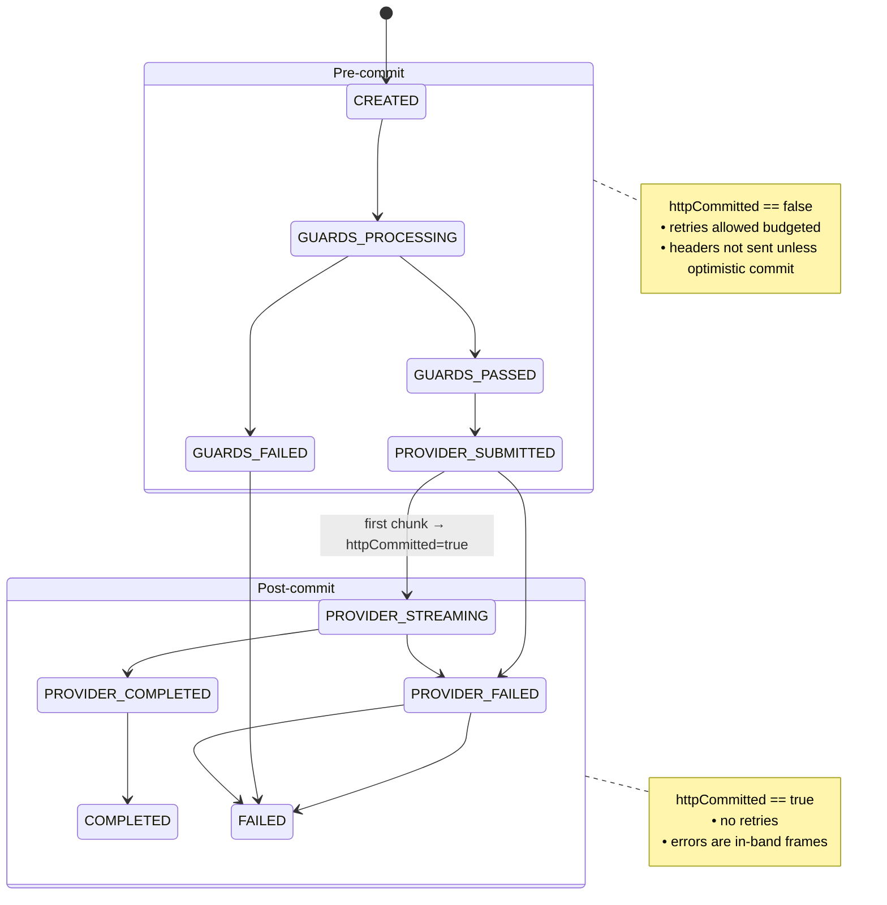

# Unified Request Orchestration Design Document

## Overview

**Brief Description**: A unified request orchestration system that manages the complete lifecycle of LLM requests including guards, validation, provider streaming, and error handling through a consistent streaming interface.

**Problem Statement**: Currently, the system has fragmented handling of:
- Guard validation (runs independently without lifecycle integration)
- Provider errors (SDK errors don't create proper streaming envelopes)
- Request tracking (no unified context across guards → queue → worker → provider)
- HTTP response timing (commits to 200 before knowing guards pass)
- Status visibility (no way to stream progress messages like "processing guards...")

**Success Criteria** (with quantitative targets):
1. All requests flow through unified orchestrator regardless of guards/validation/provider stage
2. HTTP 200 not committed until guards pass and first provider chunk arrives (with optimistic timeout budget)
3. Guards report results through master request ID with sub-request tracking
4. Status messages streamed to client ("processing guards...", "guards passed", etc.)
5. All errors (guard failures, validation errors, provider errors) create proper streaming envelopes
6. Request context queryable at any point in lifecycle **across all API nodes** (Redis-backed registry)
7. Audit logs created for all stages with proper parent/child relationships
8. Client disconnects propagate abort signals through entire pipeline (HTTP → Orchestrator → Worker → Provider)
9. Backpressure handling prevents unbounded buffering
10. Idempotent request handling with configurable retry budgets
11. All streaming envelopes include terminal verdict frame with `ok: true|false`
12. Heartbeat/status frames emitted every 5s to keep connections alive

**Quantitative Success Metrics** (SLOs):
- **TTFT (Time to First Token)**: p95 < 2000ms, p99 < 3000ms
- **Guard Latency**: p95 < 1500ms (within budget)
- **Memory Growth**: < 5% increase under 1000 concurrent streams
- **Duplicate Chunks**: Zero duplicates per 10,000 streams (deduplication effectiveness)
- **Retry Rate**: < 2% of requests require retry (provider stability)
- **Abort Success**: > 99% of aborted requests stop provider within 500ms
- **Registry Size**: Bounded by TTL, no leaks (max 10,000 entries at steady state)

---

## System Boundary

```
┌─────────┐    HTTP/SSE    ┌─────────────┐   RabbitMQ   ┌────────┐   SDK Calls   ┌──────────┐
│ Client  │◄──────────────►│  API Server │◄────────────►│ Worker │◄─────────────►│ Provider │
│         │                │(Orchestrator)│              │        │               │(LLM API) │
└─────────┘                └──────┬──────┘              └────────┘               └──────────┘
                                  │
                                  ▼
                            ┌──────────┐
                            │  Redis   │ (Registry + Pub/Sub)
                            └──────────┘
                                  │
                                  ▼
                            ┌──────────┐
                            │PostgreSQL│ (Audit + Snapshots)
                            └──────────┘
```

---

## Architecture

### Core Components

1. **RequestOrchestrator** (`/src/services/orchestrator.service.ts`) - Master coordinator for request lifecycle
2. **RequestRegistry** (`/src/services/request.registry.ts`) - **Redis-backed** distributed request context storage
3. **RequestContext** (`/src/types/orchestrator.types.ts`) - Unified state tracking across all stages
4. **Provider Orchestrators**:
   - **BaseProviderOrchestrator** (`/src/providers/base.orchestrator.ts`) - Abstract base with lifecycle hooks
   - **ClaudeOrchestrator** (`/src/providers/claude/claude.orchestrator.ts`) - Stateful Claude event synthesizer
   - **OpenAIOrchestrator** (`/src/providers/openai/openai.orchestrator.ts`) - Stateful OpenAI event synthesizer
   - **OllamaOrchestrator** (`/src/providers/ollama/ollama.orchestrator.ts`) - Stateful Ollama event synthesizer
5. **GuardCoordinator** (`/src/guards/guard.coordinator.ts`) - Guard execution and result aggregation
6. **StreamEnvelopeFactory** (`/src/providers/holo/envelope.factory.ts`) - Creates proper streaming lifecycle events
7. **CancellationCoordinator** (`/src/services/cancellation.coordinator.ts`) - Handles client disconnects and abort signals

### Data Flow Summary

| Phase | Inputs | Outputs | Side Effects |
|-------|--------|---------|--------------|
| **Request Creation** | HttpApiRequest, LLMWorkerRequest | RequestContext | Redis registry entry, optimistic timers started |
| **Guard Processing** | RequestContext, guard configs | GuardResult[] | Sub-requests queued, status messages streamed |
| **Provider Submission** | RequestContext, LLMWorkerRequest | Queue message | RabbitMQ enqueue, TTFT timer active |
| **Provider Streaming** | Provider chunks, RequestContext | Lifecycle frames | HTTP commit (first chunk), sequence tracking, backpressure |
| **Error Handling** | Error, RequestContext, stage | Error envelope | Terminal frame (ok:false), audit logs |
| **Cleanup** | RequestContext | Audit records | Redis deletion, stream close, metrics recorded |

---

## Visual Architecture Diagrams

### 1. High-Level Flow (Mermaid Flowchart)

Shows the complete request lifecycle including success paths, guard failures, and error handling.

```mermaid
flowchart TD
  subgraph Client["Client (SSE/JSONL native)"]
  end

  Client -->|POST /api/...| A[API Controller]

  A --> B[RequestOrchestrator.createRequest()]
  B -->|create ctx + registry Redis\nstart budgets guards, TTFT\nbuffered ResponseStream| C[GuardCoordinator]

  C -->|status: Processing guards...| C
  C -->|PASS| D[Stream status: Guards passed]
  C -->|FAIL| G[Guard Error Envelope\nterminal: ok=false]
  G -->|Commit 200 if not yet\nstream error| X[cleanup + audit]
  X --> Client

  D --> E[submitToProvider]
  E -->|status: Submitting to provider...| E
  E --> Q[[Request Queue]]
  Q --> W[Worker]
  W --> P[Provider SDK\nClaude/OpenAI/Ollama]

  P -->|first chunk| H[handleProviderChunk]
  H -->|Commit 200 + headers\nflush buffered statuses\nstage→PROVIDER_STREAMING| I[Provider Orchestrator\nClaude/OpenAI/Ollama]
  I -->|normalized lifecycle frames| S[Stream to client]
  S --> Client

  I -->|final content + message_stop| J[Terminal frame\nok=true]
  J --> K[cleanup + audit]
  K --> Client

  P -->|pre-stream error| PS[Retry pre-commit, budgeted?]
  PS -->|retry succeeds| H
  PS -->|retry exhausted| PE[Error Envelope\nterminal ok=false]
  PE -->|Commit 200 if not yet| K

  I -->|mid-stream error| ME[Synthesize error block\nterminal ok=false]
  ME --> K
```

### 2. Sequence Diagram (Request Lifecycle with Timing)

Shows the temporal flow including budgets, heartbeats, backpressure, and cancellation.

```mermaid
sequenceDiagram
  participant C as Client
  participant API as API Controller
  participant ORC as RequestOrchestrator
  participant REG as Redis Registry ctx/pubsub
  participant G as GuardCoordinator
  participant Q as Request Queue
  participant W as Worker
  participant P as Provider SDK
  participant ENV as Provider Orchestrator

  C->>API: POST /messages stream=true
  API->>ORC: createRequest req,res
  ORC->>REG: put ctx: CREATED, budgets started
  ORC-->>C: buffered status Processing guards...

  ORC->>G: executeGuards parentRequestId
  G-->>ORC: results pass/fail

  alt Guards PASS within GUARDS_BUDGET
    ORC-->>C: buffered status Guards passed
  else Budget exceeded
    ORC-->>C: Commit 200 + stream status optimistic
  end

  ORC->>Q: enqueue LLM request
  W->>REG: check abort?
  W->>P: start stream AbortSignal

  P-->>W: first chunk
  W-->>ORC: chunk seq=1
  ORC->>REG: set httpCommitted=true; stage=PROVIDER_STREAMING
  ORC-->>C: commit 200 + flush buffered statuses
  ORC->>ENV: feed chunk
  ENV-->>ORC: lifecycle frames
  ORC-->>C: frames apply backpressure

  loop While streaming
    Note over ORC: If res.write = false\npause provider via control msg
    ORC-->>W: pause
    ORC-->>W: resume on drain
    par Heartbeat every 5s idle
      ORC-->>C: type:heartbeat, stage, ts
    end
  end

  alt Mid-stream error
    P-->>W: error event
    W-->>ORC: error payload
    ORC->>ENV: feedError
    ENV-->>ORC: synthesized error block + terminal ok:false
    ORC-->>C: error frames + done
  else Normal completion
    P-->>W: done
    W-->>ORC: final
    ORC-->>C: terminal ok:true
  end

  ORC->>REG: delete ctx TTL cleanup
  ORC-->>C: optional h2/h3 trailers: X-Stream-Ok, X-Stream-Code

  C--xAPI: disconnect
  API->>ORC: req close → abort
  ORC->>REG: set aborted=true; pub cancel masterRequestId
  REG-->>W: cancel signal
  W->>P: abort
  ORC-->>C: connection closed
```

### 3. State Machine Diagram (Pre-Commit vs Post-Commit)

Shows the stage transitions and httpCommitted enforcement.



---

## Request Lifecycle Workflow (ASCII)

For terminal viewing and quick reference:

```
                          ┌───────────────────────────────┐
                          │        Client Request         │
                          │  (HTTP POST /api/... )        │
                          └──────────────┬────────────────┘
                                         │
                                         ▼
┌──────────────────────────────────────────────────────────────────────────────┐
│                  API Controller / Entry Point                                │
│  - Parses request into LLMWorkerRequest                                     │
│  - Creates RequestOrchestrator instance                                     │
└──────────────────────────────┬───────────────────────────────────────────────┘
                               │
                               ▼
┌──────────────────────────────────────────────────────────────────────────────┐
│                 RequestOrchestrator.createRequest()                          │
│  - Generate masterRequestId                                                  │
│  - Create RequestContext (stage: CREATED)                                    │
│  - Register in RequestRegistry (Redis)                                       │
│  - Create ResponseStream (buffered, headers not committed)                   │
│  - Start optimistic timeout windows (guards + TTFT budgets)                  │
└──────────────────────────────┬───────────────────────────────────────────────┘
                               │
                               ▼
┌──────────────────────────────────────────────────────────────────────────────┐
│                    GuardCoordinator (if enabled)                             │
│  ┌────────────────────────────────────────────────────────────────────────┐ │
│  │ 1. Stream status: "Processing guards..."                               │ │
│  │ 2. Execute all guards (sub-requests with parentRequestId)              │ │
│  │ 3. Wait for all guard results (synchronous barrier)                    │ │
│  │ 4. Aggregate results: passed / failed                                  │ │
│  └────────────────────────────────────────────────────────────────────────┘ │
│        │                                                               │
│        │ Guards Passed                                                 │ Guards Failed
│        ▼                                                               ▼
│  ┌──────────────────────────────┐                       ┌─────────────────────────────┐
│  │ Stream "Guards passed"       │                       │ Create error envelope       │
│  │ Continue to provider stage   │                       │ Commit HTTP 200 + stream    │
│  └──────────────────────────────┘                       │ Terminal frame (ok:false)   │
│                                                         │ Cleanup + audit logs        │
│                                                         └─────────────────────────────┘
└──────────────────────────────┬────────────────────────────────────────────────────────┘
                               │ (if guards passed)
                               ▼
┌──────────────────────────────────────────────────────────────────────────────┐
│            RequestOrchestrator.submitToProvider()                            │
│  - Stage: PROVIDER_SUBMITTED                                                 │
│  - Stream status: "Submitting to provider..."                                │
│  - Send request to distributed queue                                         │
│  - Wait for first provider chunk (with TTFT budget)                          │
└──────────────────────────────┬───────────────────────────────────────────────┘
                               │
                               ▼
                ┌───────────────────────────────────────────┐
                │                Worker Node                │
                │  - Receives LLM request from queue        │
                │  - Check abort signal (may be cancelled)  │
                │  - Invokes provider SDK with AbortSignal  │
                └──────────────────────────┬────────────────┘
                                           │
                                           ▼
                          ┌────────────────────────────────────┐
                          │          Provider Stream            │
                          │ (Claude / OpenAI / Ollama)          │
                          └────────────────────────────────────┘
                                           │
                                           ▼
┌──────────────────────────────────────────────────────────────────────────────┐
│             RequestOrchestrator.handleProviderChunk()                        │
│  - On first chunk:                                                           │
│       * Commit HTTP 200 + headers                                            │
│       * Flush buffered status messages                                       │
│       * Stage → PROVIDER_STREAMING                                           │
│       * httpCommitted = true                                                 │
│  - Process subsequent chunks:                                                │
│       * Provider orchestrator feeds chunk → emits lifecycle events           │
│       * Check sequence number (deduplication)                                │
│       * Apply backpressure if client slow                                    │
│       * Push to ResponseStream → client                                      │
│  - Emit heartbeats every 5s if idle                                          │
│  - On final chunk → terminal frame (ok:true) + cleanup                       │
└──────────────────────────────┬───────────────────────────────────────────────┘
                               │
                               ▼
              ┌──────────────────────────────────────────────┐
              │           Error Handling Paths               │
              │──────────────────────────────────────────────│
              │ Guard failure: stream guard error envelope   │
              │ Provider pre-stream error: retry if eligible │
              │   then stream error envelope with ok:false   │
              │ Provider mid-stream error: synthesize error  │
              │   envelope via provider orchestrator         │
              └──────────────────────────────────────────────┘
                               │
                               ▼
┌──────────────────────────────────────────────────────────────────────────────┐
│                 RequestOrchestrator.cleanup()                                │
│  - Close ResponseStream                                                      │
│  - Remove from RequestRegistry (Redis)                                       │
│  - Create final audit logs (with timestamps, parent/child relationships)     │
│  - Stage → COMPLETED or FAILED                                               │
└──────────────────────────────────────────────────────────────────────────────┘
                               │
                               ▼
                          ┌──────────────────────────────┐
                          │       Client Receives        │
                          │  → Status updates             │
                          │  → Provider content stream    │
                          │  → Terminal frame (ok:true/false)│
                          │  → Optional HTTP trailers     │
                          └──────────────────────────────┘
```

---

## Lifecycle Stage Summary

| Stage | Description | Trigger |
|-------|-------------|---------|
| CREATED | Request context initialized | on createRequest() |
| GUARDS_PROCESSING | Guards running | before any provider work |
| GUARDS_PASSED | Guards succeeded | guards finished OK |
| GUARDS_FAILED | Guards failed | guard validation fail |
| PROVIDER_SUBMITTED | Provider request queued | after guards passed |
| PROVIDER_STREAMING | Streaming chunks to client | after first chunk |
| PROVIDER_COMPLETED | Provider finished normally | after message_stop |
| PROVIDER_FAILED | Provider threw exception | pre- or mid-stream |
| COMPLETED / FAILED | Final cleanup | after stream closed |

---

## Key Design Decisions

### 1. Why Redis-Backed Registry?

**Problem**: In-memory registry breaks with autoscaling, restarts, or blue/green deployments. Request status becomes unqueryable after node failure.

**Decision**: Store RequestContext in Redis with TTL + local LRU cache

**Benefits**:
- Any API node can query request status
- Survives node restarts and rebalancing
- Enables distributed cancellation signals via pub/sub
- Hot requests served from local cache (low latency)

**Trade-offs**:
- Added Redis dependency
- Serialization overhead for context updates
- Must handle Redis connection failures gracefully

---

### 2. Why Stateful Provider Orchestrators for All Providers?

**Problem**: Status messages ("Processing guards...") injected into stream violate provider streaming protocols. Each provider expects specific initialization chunks (e.g., OpenAI needs `{delta: {role: "assistant"}}` before content, Claude needs `message_start` before any blocks).

**Decision**: Implement stateful orchestrators for Claude, OpenAI, and Ollama that track stream state and inject required initialization events.

**Benefits**:
- Status messages properly wrapped in provider-specific format
- Synthetic events injected when needed (Claude's content_block_start/stop)
- Error envelopes always valid per provider protocol
- Easy to test streaming invariants

**Trade-offs**:
- More complexity than stateless pass-through
- Must maintain state per request
- Need to reset state between requests

---

### 3. Why Two-Stage Optimistic Timeout Windows?

**Problem**: Buffering HTTP response until guards pass + first chunk could cause client timeouts or leave clients hanging without feedback.

**Decision**: Two-stage budget system:
- **Guards budget** (1500ms): If guards not done, commit HTTP 200 and start streaming status
- **TTFT budget** (2000ms): If no first chunk, commit HTTP 200 and stream "waiting for provider..."

**Benefits**:
- Clients never wait indefinitely without feedback
- Keeps load balancers happy (no idle connection timeouts)
- Clear SLO enforcement with measurable budgets
- Graceful degradation under slow guards/providers

**Trade-offs**:
- May commit HTTP 200 before knowing outcome
- Requires streaming errors (can't use HTTP 4xx/5xx after commit)
- Need terminal frames to signal actual outcome

---

### 4. Why httpCommitted-Based State Machine?

**Problem**: Without strict state validation, could retry requests after bytes sent to client, or attempt invalid stage transitions.

**Decision**: Enforce httpCommitted flag with clear pre-commit vs post-commit stage groups. Once httpCommitted=true, certain transitions become illegal (e.g., can't retry, can't go back to guards).

**Benefits**:
- Prevents catastrophic bugs (retrying after streaming started)
- Clear contract for what operations are safe
- Easy to validate in tests
- Audit trail shows exactly when commitment happened

**Trade-offs**:
- More complex state machine logic
- Must carefully track httpCommitted across all paths
- Can't use simpler linear state progression

---

### 5. Why Sequence Numbers + Deduplication?

**Problem**: RabbitMQ provides at-least-once delivery. Duplicate messages could send duplicate content chunks to client, corrupting stream.

**Decision**: Include monotonic sequence number on all chunks. Orchestrator tracks last seen seq and drops duplicates.

**Benefits**:
- Handles queue message duplication gracefully
- Can detect out-of-order delivery
- Maintains stream integrity
- Works with any at-least-once queue system

**Trade-offs**:
- Added field on every message
- Must persist streamSeq in RequestContext
- Need to handle seq gaps (out-of-order handling)

---

### 6. Why Strict Retry Budget (Pre-Commit Only)?

**Problem**: Retrying after HTTP 200 committed would send duplicate content to client. But transient provider errors (timeouts, 429, 5xx) should be retried.

**Decision**: Configurable retry policy with **strict rule**: Never retry after httpCommitted=true. Only retry transient errors before committing.

**Benefits**:
- Automatic recovery from brief provider outages
- Prevents cascading failures
- Safe: can't duplicate content to client
- Configurable per error type (429, 500, ETIMEDOUT)

**Trade-offs**:
- Can't retry mid-stream errors (must stream error envelope)
- Need to classify errors as retryable vs permanent
- Retry budget exhausted = client sees error

---

### 7. Why Terminal Verdict Frame?

**Problem**: All responses are HTTP 200 (streaming). Clients can't distinguish success from error without parsing entire stream.

**Decision**: Every stream ends with explicit terminal frame: `{type: "done", ok: true|false, errors?: [...], usage: {...}, timing: {...}}`

**Benefits**:
- Clients can treat ok:false as exception despite HTTP 200
- Aggregate metrics available in one place
- Clear end-of-stream signal
- Works across all providers

**Trade-offs**:
- Clients must parse terminal frame
- Need to buffer metrics until end
- Provider orchestrators must emit terminal frame

---

### 8. Why Heartbeats Every 5 Seconds?

**Problem**: Long-running requests with idle periods (slow guards, slow provider startup) timeout at load balancers. Client has no feedback that stream is still alive.

**Decision**: Emit `{type: "heartbeat", timestamp: ..., message: "..."}` frames every 5s when idle.

**Benefits**:
- Prevents load balancer connection timeouts (common at 30-60s idle)
- Clients know stream is still alive
- Stage-specific messages provide status visibility
- Minimal overhead (one small frame per 5s)

**Trade-offs**:
- Added timer per request
- Small bandwidth overhead
- Clients must handle heartbeat frames

---

### 9. Why Cancellation Propagation?

**Problem**: Client disconnects don't stop provider processing. Waste tokens and worker capacity on abandoned requests.

**Decision**: Wire AbortController from HTTP request → Orchestrator → Worker → Provider SDK. Use Redis pub/sub for distributed cancellation signals.

**Benefits**:
- Stop wasting tokens on disconnected clients
- Free up worker capacity faster
- Reduce provider API costs
- Clean resource cleanup

**Trade-offs**:
- More complex abort signal wiring
- Need Redis pub/sub for cross-node cancellation
- Provider SDKs must support abort signals

---

### 10. Why Backpressure Handling?

**Problem**: Fast provider + slow client = unbounded memory buffering. Can OOM Node.js process.

**Decision**: Monitor stream.write() return value. If false (buffer full), pause provider stream. Resume on 'drain' event.

**Benefits**:
- Prevent OOM from buffering
- Maintain bounded memory usage per request
- Natural flow control
- Works with any Node.js stream

**Trade-offs**:
- Need to wire pause/resume to provider SDK
- Adds latency when client slow
- Must handle pause/resume state correctly

---

## Type System

**Location**: `/src/types/orchestrator.types.ts`

### RequestContext

Core fields:
- **Identity**: masterRequestId, idempotencyKey, organizationId, nodeId
- **Lifecycle**: stage, httpCommitted (critical for state machine)
- **Guards**: GuardContext with sub-request tracking
- **Provider**: ProviderContext with metrics
- **Cancellation**: aborted flag, AbortController (in-memory only)
- **Stream tracking**: streamSeq (for deduplication), lastHeartbeatAt
- **Retry**: retryPolicy, retryCount
- **Budgets**: guardsMs, ttftMs (SLO enforcement)
- **Timestamps**: createdAt, guardsStartedAt, providerStartedAt, firstChunkAt, completedAt

### RequestStage Enum

Pre-commit stages:
- CREATED, GUARDS_PROCESSING, GUARDS_PASSED, GUARDS_FAILED, PROVIDER_SUBMITTED, PROVIDER_FAILED

Post-commit stages:
- PROVIDER_STREAMING, PROVIDER_COMPLETED, COMPLETED, FAILED

### GuardContext

Fields:
- enabled, subRequestIds[], status, results[]
- timeoutMs, failurePolicy (fail_open | fail_closed)

### RetryPolicy

Fields:
- maxRetries, retryableErrors[], backoffMs, jitterMs
- **Rule**: Never retry if httpCommitted=true

### TerminalFrame

Fields:
- type: "done", ok: boolean
- errors?: [{provider, code, message}]
- usage?: {inputTokens, outputTokens, totalTokens}
- timing?: {guardsMs, ttftMs, totalMs}

### StatusMessage

Fields:
- type: "status", stage, message, timestamp
- guards?: [{name, status}] (live guard progress)

### HeartbeatFrame

Fields:
- type: "heartbeat", timestamp, message

---

## Critical Production Requirements

### 1. Distributed Registry (Redis)

**Implementation**:
- Store RequestContext in Redis with TTL (default 10 minutes)
- Local LRU cache (default 1000 entries) for hot lookups
- Pub/sub channels for lifecycle events and cancellation

**Serialization**:
- Exclude non-serializable fields (AbortController, stream, httpResponse)
- Reconstruct on-demand when context retrieved from Redis

**Failover**:
- If Redis unavailable, local cache continues serving
- Graceful degradation (status queries fail, streaming continues)
- Auto-reconnect and cache resync

---

### 2. Cancellation & Abort Signals

**HTTP Layer**:
- Wire req.on('close') to set context.aborted=true
- Persist abort state to Redis
- Publish cancellation signal to pub/sub channel

**Worker Layer**:
- Subscribe to cancellation channel for request ID
- Check context.aborted before starting provider call
- Pass AbortSignal to provider SDK

**Provider Layer**:
- Provider SDKs support signal: abortController.signal
- Gracefully stop streaming on abort

---

### 3. Backpressure Handling

**Implementation**:
- Check stream.write() return value
- If false, call pauseProvider() via queue message
- Listen for stream 'drain' event
- Call resumeProvider() to continue streaming

**Benefits**:
- Bounded memory per request
- Natural flow control
- Works with all Node.js streams

---

### 4. Idempotency & Deduplication

**Sequence Numbers**:
- Monotonic streamSeq field on RequestContext
- Increment on every chunk emitted
- Include seq in all LLMWorkerResponse messages

**Deduplication**:
- Compare chunk.seq to context.streamSeq
- Drop if seq <= context.streamSeq (duplicate)
- Warn if seq > context.streamSeq + 1 (out-of-order)

---

### 5. Retry Budget & Policy

**Configuration**:
- RETRY_MAX_ATTEMPTS=1 (default)
- RETRY_BACKOFF_MS=1000, RETRY_JITTER_MS=500
- RETRY_RETRYABLE_ERRORS=ETIMEDOUT,429,500,502,503,504

**Rules**:
- Only retry if httpCommitted=false
- Only retry retryable errors (timeouts, rate limits, 5xx)
- Exponential backoff with jitter
- Track retryCount in RequestContext

---

### 6. Optimistic Timeout Windows

**Budgets**:
- GUARDS_BUDGET_MS=1500 (default)
- TTFT_BUDGET_MS=2000 (default)

**Behavior**:
- Start both timers on createRequest()
- If guards budget exceeded and not committed → commit + stream status
- If TTFT budget exceeded and not committed → commit + stream status
- Clear timers when HTTP commits normally

---

### 7. Terminal Verdict Frame

**Always Emitted**:
- At end of every stream (success or failure)
- Before closing ResponseStream

**Fields**:
- ok: boolean (true if COMPLETED, false if FAILED)
- errors: array (if any errors occurred)
- usage: token counts
- timing: breakdown of time spent in each stage

---

### 8. Heartbeat & Keepalive

**Implementation**:
- setInterval(5000) per request
- Check if httpCommitted && !completedAt
- Check if now - lastHeartbeatAt > 5000
- Emit heartbeat frame with stage-specific message

**Messages**:
- GUARDS_PROCESSING: "Still processing guards..."
- PROVIDER_SUBMITTED: "Waiting for provider..."
- PROVIDER_STREAMING: "Streaming..."

---

### 9. State Machine Invariants

**Pre-Commit Stages**:
- CREATED, GUARDS_PROCESSING, GUARDS_PASSED, GUARDS_FAILED, PROVIDER_SUBMITTED, PROVIDER_FAILED

**Post-Commit Stages**:
- PROVIDER_STREAMING, PROVIDER_COMPLETED, COMPLETED, FAILED

**Validation**:
- Reject transition to post-commit stage if httpCommitted=false
- Reject transition back to guards after httpCommitted=true
- Reject any transition from COMPLETED or FAILED (terminal)

---

### 10. Envelope Invariants

**Claude**:
- message_start must precede any content
- content_block_start before content_block_delta
- content_block_stop before message_stop
- Every opened block must close

**OpenAI**:
- First chunk must include {delta: {role: "assistant"}}
- Content chunks: {delta: {content: "..."}}
- Final chunk: {finish_reason: "stop"}

**Ollama**:
- First chunk includes role in message
- Content chunks: {message: {content: "..."}, done: false}
- Final chunk: {done: true}

---

## Provider Streaming Contracts

Testable invariants enforced by provider orchestrators:

| Provider | Required Initialization | Content Format | Termination | Notes |
|----------|------------------------|----------------|-------------|-------|
| **Claude** | `message_start` → `content_block_start` | `content_block_delta` with `text_delta` or `input_json_delta` | `content_block_stop` → `message_stop` | Must close all opened blocks before message_stop |
| **OpenAI** | First chunk: `{delta: {role: "assistant"}}` | `{delta: {content: "..."}}` | `{finish_reason: "stop"}` followed by `[DONE]` marker | Role must precede content; streaming_options for usage |
| **Ollama** | First chunk: role in message | `{message: {content: "..."}, done: false}` | `{done: true, done_reason: "stop"}` | done=false for all content chunks |

**Contract Validation**:
- Provider orchestrators enforce these invariants via state machine
- Tests verify each orchestrator emits correct sequence
- Violations logged as errors with fallback to pass-through mode

---

## Observability Architecture

```
┌──────────────┐
│  API Server  │
│ (Orchestrator)│────┐
└──────┬───────┘    │
       │            │ Metrics (Prometheus)
       │            ▼
       │      ┌─────────────┐
       │      │   Metrics   │
       │      │  Collector  │
       │      └─────────────┘
       │
       │ Traces (OpenTelemetry)
       ▼
┌──────────────┐         ┌──────────────┐
│   Jaeger /   │◄────────│  OTel Agent  │
│  Tempo Span  │         │  (Collector) │
└──────────────┘         └──────────────┘
       ▲                        ▲
       │                        │
       │ Trace propagation      │ Context injection
       │ (masterRequestId)      │
       │                        │
┌──────┴──────┐          ┌──────────────┐
│   Worker    │          │   Provider   │
│             │          │     SDK      │
└─────────────┘          └──────────────┘
       │
       │ Audit Logs
       ▼
┌──────────────┐         ┌──────────────┐
│  PostgreSQL  │         │  Log Sink    │
│(Audit Tables)│         │(Grafana Loki)│
└──────────────┘         └──────────────┘
```

**Tracing Integration** (OpenTelemetry):
- **Root Span**: Created at `RequestOrchestrator.createRequest()` with masterRequestId
- **Child Spans**:
  - `guards.execution` (parent: root) - Guard processing with individual guard spans
  - `provider.submit` (parent: root) - Queue submission
  - `provider.stream` (parent: root) - Provider streaming with TTFT timing
  - `orchestrator.envelope` (parent: provider.stream) - Envelope synthesis
- **Span Attributes**:
  - `request.id`, `organization.id`, `provider.type`, `model.name`
  - `stage`, `httpCommitted`, `retry.count`
  - `guard.passed`, `guard.duration`, `ttft.ms`
- **Trace Propagation**: masterRequestId as W3C trace context through queue messages

**SLO/SLA Mapping**:
| Metric | Type | SLO Target | SLA Commitment |
|--------|------|-----------|----------------|
| TTFT p95 | Latency | < 2000ms | < 3000ms (99.9%) |
| Guard Latency p95 | Latency | < 1500ms | N/A (internal) |
| Uptime | Availability | 99.9% | 99.5% (customer) |
| Duplicate Rate | Correctness | 0% | < 0.01% (customer) |
| Abort Success | Operational | > 99% | N/A (internal) |

---

## Future Enhancements

### Phase 2: Parallel Guards
**Goal**: Execute independent guards concurrently to reduce p95 latency.

**Design**:
- GuardCoordinator spawns parallel guard tasks
- Still wait for all results (synchronous barrier)
- Track which guards can run in parallel (dependency graph)
- Target: Reduce guard latency from 1500ms → 800ms p95

**Compatibility**: Backward compatible, feature-flagged

---

### Phase 3: Multi-Provider Ensemble
**Goal**: Support requests that fan out to multiple providers and aggregate results.

**Use Cases**:
- Consensus voting (3 providers, majority wins)
- Retrieval-augmented generation (embedding provider + LLM provider)
- Provider fallback (try Claude, fall back to OpenAI on failure)

**Design**:
- Master request tracks multiple provider sub-requests
- Each provider gets own orchestrator instance
- Aggregate terminal frames with voting/merging logic
- Target: Enable A/B testing and provider redundancy

**Complexity**: High (requires request tree, not just parent/child)

---

### Phase 4: Dynamic Provider Selection
**Goal**: Route to providers based on real-time metrics (latency, cost, availability).

**Design**:
- Provider registry tracks real-time TTFT, error rates
- Orchestrator selects provider dynamically per request
- Fallback chains configured per organization
- Target: Reduce costs by 20% via smart routing

**Dependencies**: Phase 3 (multi-provider support)

---

### Phase 5: Guard Result Caching
**Goal**: Cache guard results for identical prompts to reduce latency.

**Design**:
- Hash prompt content → cache key
- TTL-based cache (Redis or in-memory)
- Only cache PASS results (fail must re-evaluate)
- Target: Reduce guard overhead by 50% for repeat requests

**Trade-offs**: Privacy concerns (prompt hashing), cache invalidation complexity

---

### Phase 6: Provider-Native Error Recovery
**Goal**: Handle provider-specific retry strategies (e.g., Claude prompt caching).

**Design**:
- Provider orchestrators implement custom retry logic
- Respect provider-specific headers (e.g., retry-after)
- Track provider-specific error budgets
- Target: Improve retry success rate from 80% → 95%

---

## Configuration

### Environment Variables

```bash
# Orchestrator
ORCHESTRATOR_ENABLED=true
ORCHESTRATOR_NODE_ID=api-node-1
STREAM_ERROR_STRATEGY=error-frame        # error-frame|trailers|both
HEARTBEAT_INTERVAL_MS=5000

# Redis Registry
REDIS_URL=redis://localhost:6379
REGISTRY_TTL_SECONDS=600                 # 10 minutes
REGISTRY_LOCAL_CACHE_SIZE=1000

# Timeout Budgets (SLO)
GUARDS_BUDGET_MS=1500
TTFT_BUDGET_MS=2000

# Guards
GUARDS_ENABLED=true
GUARDS_TIMEOUT_MS=30000
GUARD_FAILURE_POLICY=fail_closed         # fail_open|fail_closed

# Retry Policy
RETRY_MAX_ATTEMPTS=1
RETRY_BACKOFF_MS=1000
RETRY_JITTER_MS=500
RETRY_RETRYABLE_ERRORS=ETIMEDOUT,429,500,502,503,504

# Provider Orchestrators
CLAUDE_ORCHESTRATOR_ENABLED=true
OPENAI_ORCHESTRATOR_ENABLED=true
OLLAMA_ORCHESTRATOR_ENABLED=true

# Observability
CONTEXT_SNAPSHOTS_ENABLED=false          # Disable for high throughput
AUDIT_REDACTION_ENABLED=true
```

### Database Schema Changes

**llm_requests table**:
- Add parent_request_id VARCHAR(36)
- Add sub_request_id VARCHAR(36)
- Add request_stage VARCHAR(50)
- Add httpCommitted BOOLEAN

**New table: request_context_snapshots**:
- id UUID PRIMARY KEY
- request_id VARCHAR(36)
- stage VARCHAR(50)
- context JSONB
- created_at TIMESTAMP

**Indexes**:
- idx_llm_requests_parent ON llm_requests(parent_request_id)
- idx_llm_requests_stage ON llm_requests(request_stage)
- idx_context_snapshots_request ON request_context_snapshots(request_id)

---

## Testing Strategy

### Unit Tests

**RequestOrchestrator**:
- Request context creation and registration
- Stage transitions (valid and invalid)
- httpCommitted enforcement
- Status message injection
- Cleanup and deregistration

**Provider Orchestrators** (Claude/OpenAI/Ollama):
- Initialization event synthesis
- State tracking across chunks
- Error envelope creation (pre-stream and mid-stream)
- Invariant enforcement (message_start before content, etc.)

**GuardCoordinator**:
- Guard execution and result aggregation
- Sub-request creation with parent ID
- Timeout handling (fail_open vs fail_closed)

**RequestRegistry**:
- Redis serialization/deserialization
- Local cache hit/miss behavior
- TTL expiration
- Pub/sub event publishing

**CancellationCoordinator**:
- Abort signal propagation
- Redis pub/sub message delivery
- Worker abort handling

### Integration Tests

**Guard → Provider Flow**:
- Request with guards enabled → guards pass → provider streams
- Request with guards enabled → guards fail → error envelope
- Status messages at each stage
- Audit logs with parent/child relationships

**Error Handling**:
- Pre-stream provider error → retry → error envelope
- Mid-stream provider error → error envelope
- Guard failure → error envelope with guard details

**Backpressure**:
- Fast provider + slow client → pause/resume
- Memory usage stays bounded

**Retry Logic**:
- Transient error (429) before commit → retry
- Transient error after commit → no retry, stream error
- Non-retryable error (400) → no retry, stream error

### Chaos Tests

**Worker Failures**:
- Kill worker mid-stream
- Verify terminal frame with ok:false
- Verify audit log shows PROVIDER_FAILED

**Queue Duplication**:
- Inject duplicate chunks with same seq
- Verify deduplication drops duplicates
- Verify no duplicate content to client

**Provider Rate Limits**:
- Simulate burst of 429 errors
- Verify retry budget exhaustion
- Verify exponential backoff + jitter

**Client Disconnects**:
- Disconnect mid-guard, mid-stream
- Verify abort signals propagate
- Verify worker stops processing

**Node Rebalancing**:
- Restart API node mid-request
- Verify context still queryable via Redis
- Verify graceful degradation

**Load + Latency**:
- 1000 concurrent with guards
- Measure 95p TTFT
- Verify backpressure doesn't blow memory
- Verify Redis pool doesn't saturate

**Network Partitions**:
- Simulate Redis connection loss
- Verify local cache continues serving
- Verify reconnection and resync

### End-to-End Tests

**Real Provider Integration**:
- Complete request with real Claude API
- Verify all lifecycle events
- Verify audit logs
- Query request status during lifecycle

**Real Error Scenarios**:
- Prompt too long error (250k tokens)
- Rate limit errors with retry
- Verify error envelopes valid per provider

---

## Security Considerations

**Authentication**:
- RequestOrchestrator respects JWT/API key auth from middleware
- Request context includes organizationId and userId
- Guards have access to auth context

**Authorization**:
- Guards enforce per-organization policies
- Provider selection respects organization access
- Audit logs capture auth context

**Data Validation**:
- All payloads validated before processing
- Guard results validated before proceeding
- Provider responses validated before streaming

**Sensitive Data**:
- Central redaction pass for all audit payloads
- Hash or mask PII (SSN, credit cards, API keys)
- Least-privilege DB role for audit writes
- Consider WORM storage or hash-chain for integrity

**Audit Trail**:
- All stages logged with timestamps
- Guard execution fully audited
- Failed requests create trail
- Admin access gated behind scopes

---

## HTTP Trailers (Optional)

**Purpose**: Provide canonical outcome metadata for advanced clients.

**Implementation**:
- Use HTTP/2 or HTTP/3 trailers (best-effort)
- Add after streaming body completes

**Headers**:
- X-Stream-Ok: true|false
- X-Stream-Code: GUARD_FAILED|PROVIDER_TIMEOUT|...
- X-Stream-Usage: {"input":100,"output":50}

**Benefits**:
- Clients can check success without parsing stream
- Useful for proxies and middleware
- Complements terminal frames

**Limitations**:
- Only HTTP/2 and HTTP/3
- Not all clients/proxies support trailers
- Best-effort feature (graceful degradation)

---

## Performance Considerations

**Scalability**:
- Redis-backed registry with local LRU cache
- Guards execute synchronously (parallel future enhancement)
- Provider streaming immediate (no buffering)
- TTL-based cleanup

**Caching**:
- Guard results NOT cached (run every time)
- Provider responses NOT cached (real-time streaming)
- Context snapshots optional (disable for high throughput)

**Database**:
- Parent/child relationships indexed
- Audit writes async (non-blocking)
- Partitioning by timestamp
- Archive old logs

**Memory**:
- Registry limited by TTL
- Stream buffers bounded by backpressure
- Orchestrator state minimal

**Network**:
- Guards submit to queue (async)
- Provider responses streamed as received
- Status messages minimal overhead

---

## Monitoring & Observability

### Metrics

**Business Metrics**:
- requests_total{stage} - Requests by final stage
- guards_pass_rate - Percentage passing guards
- guards_execution_time - Time in guard processing
- provider_errors_total{provider, error_type}

**Technical Metrics**:
- orchestrator_stage_duration{stage}
- time_to_first_chunk (TTFT)
- stream_buffer_time
- request_registry_size

**Performance Metrics**:
- request_lifecycle_duration
- guard_coordinator_duration
- provider_stream_duration
- retry_count, rate_limit_wait_ms

### Logging

**Structured logging** at each stage:
- Debug: Request created, stage transitions
- Info: Guards complete, provider starts, stream ends
- Error: Failures with full context
- Audit: All stages, guard results, errors

### Alerting

**Error Alerts**:
- guards_failure_rate > 10%
- provider_errors_rate > 5%
- orchestrator_errors_total > 10/min

**Performance Alerts**:
- time_to_first_chunk > 5s
- request_lifecycle_duration > 60s
- request_registry_size > 1000

**Business Alerts**:
- Spike in GUARDS_FAILED
- Spike in PROVIDER_FAILED

---

## Rollout Plan

### Phased Deployment

**Week 1: Core Infrastructure**
- Deploy RequestOrchestrator, RequestRegistry
- Feature flag: ORCHESTRATOR_ENABLED=false
- Run shadow mode (log but don't use)
- Validate metrics collection

**Week 2: Guard Integration**
- Deploy GuardCoordinator
- Feature flag: ORCHESTRATOR_GUARDS_ENABLED=false
- Test with subset of organizations
- Validate guard → provider flow

**Week 3: Provider Orchestrators**
- Deploy Claude/OpenAI/Ollama orchestrators
- Deploy StreamEnvelopeFactory
- Test error envelope creation

**Week 4: Gradual Rollout**
- Enable for 10% of traffic
- Monitor metrics closely
- Enable for 50%, then 100%

**Week 5: Cleanup**
- Remove old error handling code
- Remove feature flags
- Update documentation

### Migration Strategy

**Backward Compatibility**:
- Old flow continues working during rollout
- Orchestrator wraps existing services
- No breaking changes

**Rollback Plan**:
- Set ORCHESTRATOR_ENABLED=false
- No data loss (both flows write audits)
- Metrics show both flows

---

## Dependencies

### Internal

**Services**:
- ResponseService, StreamService, GuardPipeline, AuditService, QueueService

**Database**:
- llm_requests table with parent/child support
- request_context_snapshots table

**Queue**:
- Request/response queues
- Guard queue (new)

### External

**APIs**:
- Claude API (Anthropic SDK)
- OpenAI API (OpenAI SDK)
- Ollama API (Ollama SDK)

**Libraries**:
- tsyringe (DI)
- express (HTTP)
- winston (logging)
- amqplib (RabbitMQ)
- ioredis (Redis client)

**Infrastructure**:
- **Redis** - Distributed registry + pub/sub
- RabbitMQ - Message queue
- PostgreSQL - Audit storage
- Node.js Transform streams

---

## Risks & Mitigation

### Technical Risks

**HTTP Response Buffering**:
- Risk: Timeouts waiting for guards/first chunk
- Mitigation: Optimistic timeout budgets (1.5s guards, 2s TTFT)

**Registry Memory Leak**:
- Risk: Failed cleanup → unbounded growth
- Mitigation: TTL-based cleanup, background task, LRU eviction

**Orchestrator State Corruption**:
- Risk: State out of sync with stream
- Mitigation: Reset per request, validate transitions, fallback to pass-through

**Guards Slowing Requests**:
- Risk: Synchronous guards add latency
- Mitigation: Timeout, status messages, future parallel execution

### Business Risks

**Increased Error Visibility**:
- Risk: Clients see all errors as streaming (not HTTP errors)
- Mitigation: Clear messages, documentation, gradual rollout

**Audit Log Volume**:
- Risk: Parent/child + snapshots increase DB writes
- Mitigation: Snapshots optional, async writes, partitioning, archiving

---

## Implementation Checklist

### Pre-Implementation
- [x] Design review completed
- [ ] Security review completed
- [ ] Performance review completed
- [ ] Dependencies identified and approved

### Phase 1: Core (Week 1)
- [ ] orchestrator.types.ts (RequestContext, RetryPolicy, TerminalFrame, etc.)
- [ ] RequestRegistry (Redis + local cache)
- [ ] CancellationCoordinator (abort signals)
- [ ] RequestOrchestrator (basic lifecycle)
- [ ] State machine validation (httpCommitted)
- [ ] Optimistic timeout windows
- [ ] ResponseService integration
- [ ] StreamService (buffered + backpressure)
- [ ] Heartbeat emission
- [ ] Sequence number tracking
- [ ] Feature flags

### Phase 2: Guards (Week 2)
- [ ] GuardCoordinator
- [ ] GuardPipeline (sub-request pattern)
- [ ] Parent/child ID fields
- [ ] Guard result aggregation
- [ ] Status message injection

### Phase 3: Providers (Week 3)
- [ ] ClaudeOrchestrator
- [ ] OpenAIOrchestrator
- [ ] OllamaOrchestrator
- [ ] Provider modifications
- [ ] StreamEnvelopeFactory
- [ ] Error envelopes (all providers)
- [ ] Pre-stream and mid-stream error tests

### Phase 4: Database (Week 3)
- [ ] parent_request_id, sub_request_id, request_stage columns
- [ ] request_context_snapshots table
- [ ] AuditService modifications
- [ ] Database indexes

### Phase 5: Testing (Week 3-4)
- [ ] Unit tests (all components)
- [ ] Integration tests
- [ ] Chaos tests (7 scenarios)
- [ ] E2E tests (real APIs)

### Phase 6: Deployment (Week 4-5)
- [ ] Staging deployment (flags off)
- [ ] Shadow mode validation
- [ ] 10% rollout
- [ ] 50% rollout
- [ ] 100% rollout
- [ ] Remove feature flags

### Post-Deployment (Week 6)
- [ ] Monitor metrics 1 week
- [ ] Collect feedback
- [ ] Address bugs
- [ ] Update documentation
- [ ] Plan Phase 2 (parallel guards, etc.)

---

**Last Updated**: 2025-11-06
**Version**: 2.0.0 (Production-Ready Design)
**Status**: Ready for Implementation

## Design Review Summary

This design addresses critical production requirements:

✅ **Distributed State** - Redis-backed registry for multi-node deployments
✅ **Cancellation Propagation** - End-to-end abort signal wiring
✅ **Backpressure** - Prevent unbounded buffering
✅ **Idempotency** - Sequence numbers + deduplication
✅ **Retry Budget** - Configurable with strict pre-commit-only rule
✅ **Optimistic Timeouts** - Two-stage budget (guards + TTFT)
✅ **Terminal Verdict** - Explicit ok:true|false frames
✅ **Heartbeats** - 5s keepalive
✅ **State Machine** - httpCommitted-based validation
✅ **Envelope Invariants** - Provider-specific guarantees
✅ **Chaos Tests** - Production validation scenarios
✅ **All Providers** - Claude, OpenAI, and Ollama orchestrators

**Next Steps**: Proceed with phased implementation.
